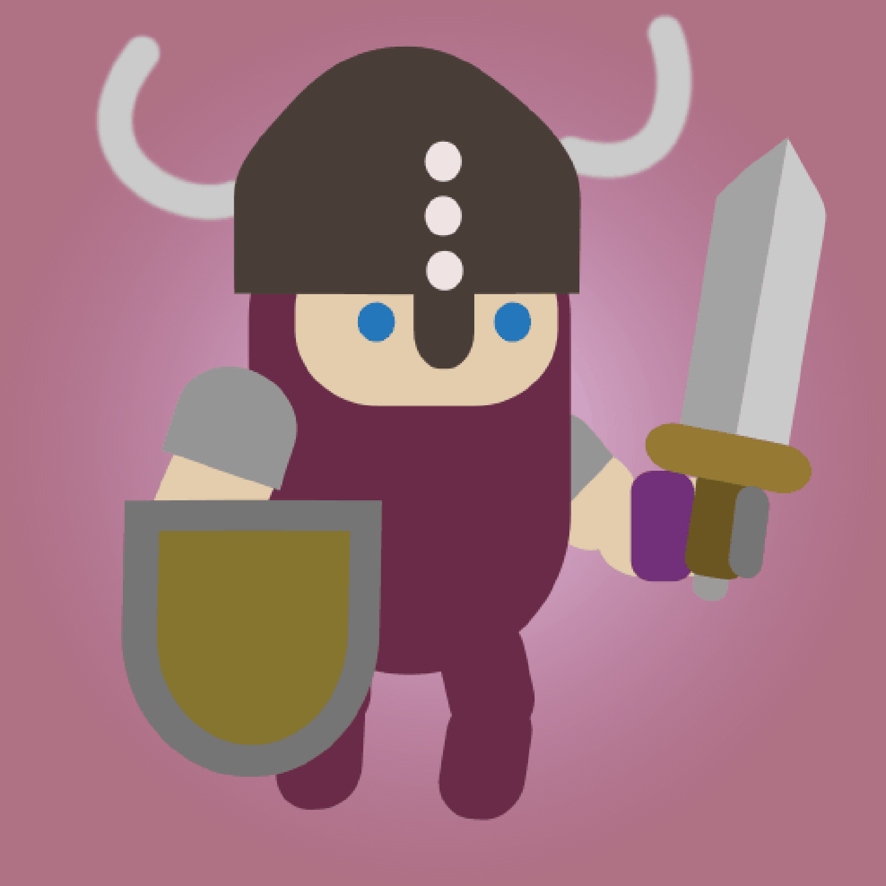

# Cyber Norse Warriors NFT Collection
This is an experimental NFT art project, used for learning purposes only.

## About the art assets (orignal svg file and png layer images)
The original image was created using [inkscape](https://inkscape.org/), and this [youtube tutorial](https://www.youtube.com/watch?v=ZX3cYoIZ934).

The layers were exported from inkscape by using the [batch-export plugin](https://github.com/StefanTraistaru/batch-export), and then they were renamed to comply with [hashlips_art_engine](https://github.com/HashLips/hashlips_art_engine#usage-%E2%84%B9%EF%B8%8F) name convention.

