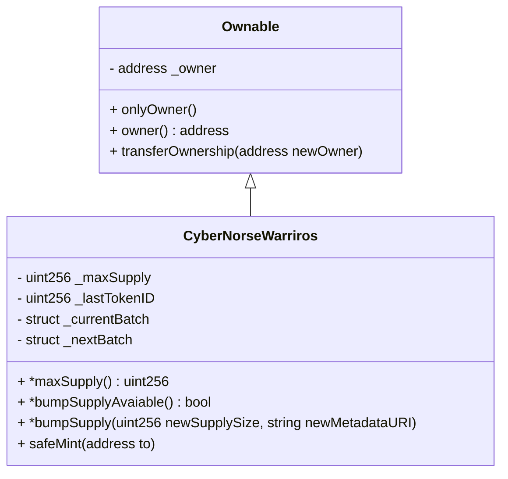

<!-- omit from toc -->
# Cyber Norse Warriors NFT Collection

This is an experimental NFT (ERC721) project, used for learning purposes only.
The project covers both the art and the solidity contract creation.
To make things a bit more interesting I choose to use Typescript for my contract tests.


- [Tech Stack](#tech-stack)
- [Project Structure](#project-structure)
- [Art assets, orignal svg file and png layer images](#art-assets-orignal-svg-file-and-png-layer-images)
- [NFT Contract](#nft-contract)
    - [Class diagram](#class-diagram)
- [Project instructions](#project-instructions)
  - [Compiling / Building the artifacts](#compiling--building-the-artifacts)
  - [Runing the tests](#runing-the-tests)
  - [How to deploy locally using HardHat node](#how-to-deploy-locally-using-hardhat-node)


## Tech Stack

- [Hardhat](https://hardhat.org/) _(as dev enviroment)_
- [Web3Storage](https://web3.storage/) _(as data layer IPFS)_
- [Ethernal](https://tryethernal.com/) _(as block explorer)_
- [Solidity](https://soliditylang.org/) _(as EVM smart-contract language)_
- [Open Zepelin](https://www.openzeppelin.com/solidity-contracts) _(as smart contract library)_
- [Typescript](https://www.typescriptlang.org/) _(as general purpose language used in tests and scripts)_
- [Mocha](https://mochajs.org/) _(as test framewor)_
- [Chai JS](https://www.chaijs.com/) _(as test assert library)_

## Project Structure

```
├── nft-art
    └── nft-layers -- home for the NFT layers
└── project -- hardhat project code
    ├── contracts
    ├── ignition
    ├── scripts
    └── test
```

## Art assets, orignal svg file and png layer images

The original image was created using [inkscape](https://inkscape.org/), and this [youtube tutorial](https://www.youtube.com/watch?v=ZX3cYoIZ934).

The layers were exported from inkscape by using the [batch-export plugin](https://github.com/StefanTraistaru/batch-export), and then they were renamed to comply with [hashlips_art_engine](https://github.com/HashLips/hashlips_art_engine#usage-%E2%84%B9%EF%B8%8F) name convention.


## NFT Contract

#### Class diagram
> "* maxSupply, bumpSupply and bumpSupplyAvaiable\n are avaiable only to the contract owner"


```mermaid

classDiagram
  class Ownable {
      - address _owner
      + onlyOwner()
      + owner() address
      + transferOwnership(address newOwner)
    }

    class CyberNorseWarriros {
      - uint256 _maxSupply
      - uint256 _lastTokenID
      - struct _currentBatch
      - struct _nextBatch
      + *maxSupply() uint256
      + *bumpSupplyAvaiable() bool
      + *bumpSupply(uint256 newSupplySize, string newMetadataURI)
      + safeMint(address to)
    }
    Ownable |>-- CyberNorseWarriros

```

## Project instructions

The actual code lives under the `project` sub-folder, so to proper compile, test and deploy the NFT contract you must be inside the `project` folder.

Before running the application make sure you have added added the information regarding the **contract owner** and the **NFT metadata URI** to the the .env file. Fell free to use [.env.example](./project/.env.example) as inspiration.

```
cd project
```

### Compiling / Building the artifacts

```
npx hardhat compile
```

### Runing the tests

```
npx hardhat test --typecheck
```

or to test a single file

```
npx hardhat test ./test/CyberNorseWarriors.ts --typecheck
```

### How to deploy locally using HardHat node

For that we will need 2 terminal windows, one to run the hardhat node and another to trigger the contract deploy via hardhat ignition.

In the frist terminal window you should type

```
npx hardhat node
```

In the second terminal window you must type:

```
npx hardhat ignition deploy ./ignition/modules/CyberNorseWarriors.ts --network localhost
```
